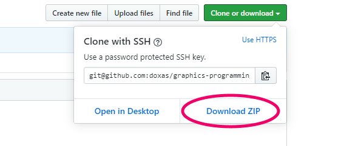

# graphics-programming-book

技術評論社（WEB+DB PRESS plus シリーズ）より発売の、「[ゲーム&モダンJavaScript文法で2倍楽しい]グラフィックスプログラミング入門 ——リアルタイムに動く画面を描く。プログラマー直伝の基本」に収録されているサンプルファイルのリポジトリです。

## 概要

[［ゲーム＆モダンJavaScript文法で2倍楽しい］グラフィックスプログラミング入門 ——リアルタイムに動く画面を描く。プログラマー直伝の基本（WEB\+DB PRESS plusシリーズ）｜gihyo\.jp … 技術評論社](https://gihyo.jp/magazine/wdpress/plus/978-4-297-11085-7)

> 楽しく遊べる2Dゲームの開発を進めながら，グラフィックスプログラミングの基本が学べる入門書。一度習得すると，ゲームや映像生成，動的可視化をはじめ，幅広い分野で長く役立つグラフィックスプログラミングの基礎。
> 
> 本書では，リアルタイムに動く画像を描くために求められる技術や考え方を平易に解説します。開発言語として，エディタとブラウザがあれば開発ができるJavaScriptを採用し，すぐにスタートできる構成が特徴です。豊富な図解に加え，いまどきのJavaScript（ES2015準拠）の基本文法，これだけは知っておきたい数学知識も厳選収録。
> 
> 一線の開発者による，現場で活かせるやさしい実践解説です。

## サンプルの実行に関する注意（stg/022, stg/023, 第８章）

一部のサンプルについてはローカルサーバーの起動が必要になります。

具体的には、シューティングゲームのサンプルのうち `stg/022` 及び `stg/023` は、音声ファイルを再生する処理が含まれているため、ローカルサーバーを起動してサンプルを実行しないと正しく動作しないようになっています。また、本書の第８章で扱う画像処理のサンプル全般では、画像ファイルを読み込んだあとに JavaScript で加工する都合から、同様にローカルサーバーを利用してサンプルを実行する必要があります。

もし、ローカルサーバーを利用せずにサンプルを実行してしまうと `Fetch API cannot load` のように、ファイルを読み込むことができない旨のエラーが発生してしまいます。

なぜこのようなエラーが起こってしまうのかの理由や、具体的なローカルサーバーを利用したサンプルの実行方法については、本書の第８章に説明がありますので参考にしてください。

## サンプルのダウンロード方法

Git の利用方法について理解がある場合、このリポジトリを clone して利用してください。

もしも Git についてよくわからない場合でも、このリポジトリを zip ファイルとしてダウンロードすることができます。

以下の図に示したように、このページの上部に置かれている `Clone or download` と書かれた緑色のボタンよりダウンロード可能です。

## 正誤表

正誤表は、このリポジトリに含まれています。

以下リンクからも参照できます。

[正誤表（errors.md）](resource/errors.md)

